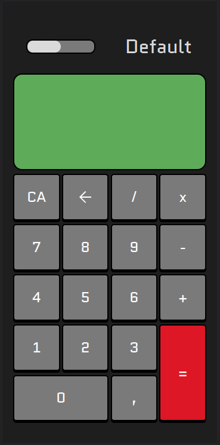

<h1>Calculator</h1>

<h2>Sobre o Projeto</h2>

    Esse projeto é uma calculadora simples no qual efetua as 4 operações básicas. 
    <ul>
        <li>soma</li>
        <li>subtração</li>
        <li>multiplicação</li>
        <li>divisão</li>
    </ul>
    Além de ter um botão temático onde é possível trocar o tema da calculadora.

<h2>Como colaborar - Criando o seu TEMA !</h2>

    <ol>
        <li>
            Entre na pasta de temas, 'style/themes' e copie o tema 'default.css'
        </li> 
        <li>
            No arquivo copiado, troque as classes 't0' de cada elemento por 'tn', onde 'n' é o número de temas existentes. 
            e salve o documento com o nome do tema que você desejar.
        </li> 
        <li>
            Após criar seu tema, você precisa referenciar ele na pagina 'style/main.css'.  
            Para isso você utiliza o comando @import url('themes/nome_tema.css');
        </li> 
        <li>
            Para finalizar basta entrar no 'src/main.js' e colocar na lista de temas o seu tema !!! 
            A lista de temas é um array de arrays, onde o primeiro parâmetro é a classe e o segundo é o nome que você quer que apareça na calculadora ! 
            exemplo:['tn','nome_do_tema']
        </li>
    </ol>

<h2>Colaboradores !!!</h2>
<ul>
    <li>Flávio Nassim Bittar Filho</li>
    <li>Rafael Augusto De Paula Mora</li>
    <li>Rafael Abreu Fonseca</li>
    <li>MateusMMattos</li>
</ul>
